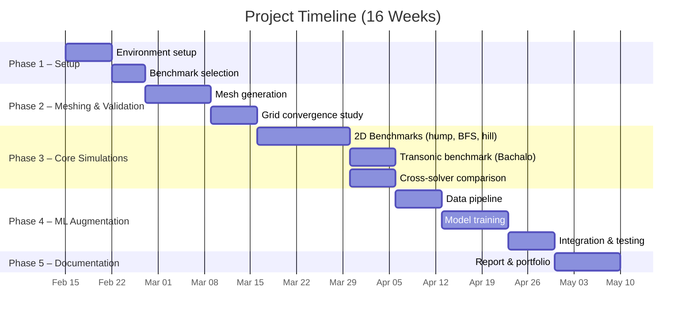

# Project Execution Plan: CFD Solver Benchmark for Flow Separation Prediction

**Author:** Yuvraj  
**Program:** MSc Space Engineering, University of Bremen  
**Date:** February 2026  
**Goal:** Demonstrate strong technical and coding skills to secure a HiWi position and industry internship.

---

## Executive Summary

This project systematically benchmarks open-source CFD solvers (OpenFOAM, SU2) across canonical flow-separation test cases, comparing RANS turbulence models against experimental and DNS/LES reference data. It culminates in an ML-augmented correction model that improves separation prediction—a publishable, portfolio-worthy contribution.

---

## Phase Overview & Timeline



---

## Phase 1: Project Setup & Environment Configuration (Weeks 1–2)

### Milestone 1.1: Development Environment

| Task | Details |
|---|---|
| Install OpenFOAM | v2312 or v2406 (ESI/Foundation). WSL2 on Windows or native Linux VM. |
| Install SU2 | v8.0+. Build from source with Python wrapper enabled. |
| Python environment | Python 3.10+, NumPy, SciPy, Matplotlib, pandas, PyTorch/TensorFlow, PyFoam, meshio. |
| Version control | Git repository with clear structure. Use branches for each benchmark case. |
| HPC access | Check University of Bremen HPC cluster access or use local multi-core workstation. |

**Directory structure:**
```
CFD-Solver-Benchmark/
├── benchmarks/
│   ├── backward_facing_step/
│   ├── wall_mounted_hump/
│   ├── periodic_hill/
│   ├── bachalo_johnson/
│   └── naca0012_stall/
├── experimental_data/
├── meshes/
├── scripts/
│   ├── preprocessing/
│   ├── postprocessing/
│   ├── comparison/
│   └── ml_augmentation/
├── results/
├── docs/
│   ├── literature_review.md
│   ├── project_execution_plan.md
│   └── figures/
└── README.md
```

### Milestone 1.2: Benchmark Case Selection

Select 4–5 benchmark cases spanning different separation mechanisms:

| # | Case | Separation Type | Re | Solver(s) | Reference Data |
|---|---|---|---|---|---|
| 1 | Backward-Facing Step | Geometry-induced | 36,000 | OpenFOAM, SU2 | Driver & Seegmiller (1985) |
| 2 | NASA Wall-Mounted Hump | APG-induced | 936,000 | OpenFOAM, SU2 | Greenblatt et al. (2006), NASA TMR |
| 3 | Periodic Hill | Curvature + APG | 10,595 | OpenFOAM | Breuer et al. (2009), DNS data |
| 4 | Bachalo-Johnson Transonic Bump | Shock-induced | 2.7M | OpenFOAM, SU2 | Bachalo & Johnson (1986) |
| 5 | NACA 0012 at stall | Trailing-edge stall | 6M | OpenFOAM, SU2 | Ladson (1988), NASA TMR |

### Milestone 1.3: Download Experimental/Reference Data

| Source | Data |
|---|---|
| NASA TMR website | Grids, Cp, Cf reference solutions for flat plate, bump, hump |
| ERCOFTAC database | Periodic hill DNS/LES profiles |
| Published papers | Reattachment lengths, velocity profiles, Reynolds stress profiles |
| Sandia ATB reports | Modern Bachalo-Johnson data (PIV, oil-film) |

---

## Phase 2: Mesh Generation & Grid Convergence (Weeks 3–4)

### Milestone 2.1: Mesh Generation

**Tools:** blockMesh + snappyHexMesh (OpenFOAM), Gmsh, or cfMesh.

| Task | Details |
|---|---|
| Create structured/hybrid meshes for each case | Ensure y+ < 1 for wall-resolved RANS. Typical first cell height: Δy ≈ 1–5 × 10⁻⁵ × L_ref. |
| Generate 3 mesh levels per case | Coarse, Medium, Fine (refinement ratio r ≈ 1.5–2.0 in each direction). |
| Export meshes for SU2 | Use meshio or CGNS format for cross-solver compatibility. |
| Document mesh parameters | Cell counts, y+ distribution, expansion ratios, aspect ratios. |

**Coding tasks:**
```python
# scripts/preprocessing/mesh_generator.py
# - Parametric mesh generation for each benchmark case
# - Automated y+ estimation based on Re and target y+
# - Export to OpenFOAM and SU2 formats
```

### Milestone 2.2: Grid Convergence Study (GCI)

| Task | Details |
|---|---|
| Run each case on 3 grids with SST k-ω | Compare Cp, Cf, separation location, reattachment location. |
| Compute GCI (Grid Convergence Index) | Roache's method. Report observed order of accuracy. |
| Select production grid | The finest grid that shows < 2% GCI for key quantities. |

**Coding tasks:**
```python
# scripts/postprocessing/grid_convergence.py
# - Parse solver output for Cp, Cf at specified locations
# - Compute Richardson extrapolation and GCI
# - Generate convergence plots (quantity vs. 1/h)
# - Output: table of GCI values for each quantity
```

> [!IMPORTANT]
> Grid convergence is the most overlooked step in published solver comparisons. Performing this rigorously will immediately distinguish your work.

---

## Phase 3: Core CFD Simulations (Weeks 5–8)

### Milestone 3.1: Turbulence Model Sweep (2D Cases)

Run each of the selected benchmarks with multiple turbulence models:

| Model | Type | Available in |
|---|---|---|
| Spalart-Allmaras (SA) | 1-equation RANS | OpenFOAM, SU2 |
| k-ω SST | 2-equation RANS | OpenFOAM, SU2 |
| k-ε Realizable | 2-equation RANS | OpenFOAM |
| k-ω SST with γ-Re_θ transition | RANS + transition | OpenFOAM, SU2 |
| DDES (SST-based) | Hybrid RANS-LES | OpenFOAM |

**For each simulation, extract and compare:**
- Surface pressure coefficient (Cp)
- Skin friction coefficient (Cf)
- Separation point (x_sep / L)
- Reattachment point (x_reat / L)
- Velocity profiles at key stations
- Reynolds stress profiles (where available)

**Coding tasks:**
```python
# scripts/postprocessing/extract_profiles.py
# - Extract wall quantities from OpenFOAM (postProcess) and SU2 output
# - Interpolate profiles at specified x/c stations
# - Compare against experimental data with error metrics (L2 norm, % error)

# scripts/comparison/cross_solver_compare.py
# - Read results from both solvers
# - Generate side-by-side comparison plots
# - Compute quantitative discrepancy metrics
# - Spider/radar plots summarizing model performance across cases
```

### Milestone 3.2: Transonic Simulation (Bachalo-Johnson)

| Task | Details |
|---|---|
| Set up compressible solver | OpenFOAM: rhoSimpleFoam or rhoPimpleFoam; SU2: Euler/RANS solver |
| Boundary conditions | Freestream M = 0.875, Re_c = 2.7 × 10⁶. Farfield or pressure outlet. |
| Run SA and SST models | Compare shock location, separation bubble size, Cp on bump surface |
| Compare with experiment | Bachalo-Johnson Cp data, turbulence intensity profiles |

### Milestone 3.3: Cross-Solver Comparison Report

**Key comparison metrics (tabulated and plotted):**
- Separation onset location error (%)
- Reattachment point error (%)
- Cp distribution RMSE
- Cf distribution RMSE
- Computational cost (CPU-hours per case)
- Convergence behavior (residual history)

---

## Phase 4: ML-Augmented Turbulence Model (Weeks 9–12)

### Milestone 4.1: Data Pipeline Construction

| Task | Details |
|---|---|
| Feature extraction | From converged RANS solutions: strain rate, rotation rate, turbulent kinetic energy, ω/ε, wall distance, pressure gradient, Reynolds stress anisotropy invariants (I₁, I₂, I₃). |
| Label generation | Compute "correction factor" β = (Q_DNS - Q_RANS) at each grid point for periodic hill case (DNS data available). Alternatively, use FIML-style field inversion. |
| Dataset creation | Tabulate features and labels. Split: 70% train, 15% validation, 15% test. Normalize/standardize features. |

**Coding tasks:**
```python
# scripts/ml_augmentation/feature_extraction.py
# - Read RANS solution fields (OpenFOAM or VTK format)
# - Compute invariant-based features (Ling et al. approach)
# - Tensor basis decomposition of Reynolds stress anisotropy

# scripts/ml_augmentation/dataset.py
# - Create PyTorch Dataset/DataLoader
# - Feature normalization, train/val/test splits
# - Save preprocessed data as .npz or .h5
```

### Milestone 4.2: ML Model Training

| Task | Details |
|---|---|
| Architecture | Tensor-basis Neural Network (TBNN) or simpler MLP with invariant inputs. Start with 3–5 hidden layers, 64–128 neurons each. |
| Training | MSE loss on correction field. Adam optimizer, learning rate scheduler. Early stopping on validation loss. |
| Evaluation | Prediction error on test set. Physical realizability checks (positive TKE, bounded anisotropy). |

**Coding tasks:**
```python
# scripts/ml_augmentation/model.py
# - PyTorch model definition (TBNN or MLP)
# - Training loop with logging (TensorBoard / W&B)
# - Evaluation metrics and visualization

# scripts/ml_augmentation/train.py
# - Hyperparameter configuration
# - Training execution script
# - Model checkpointing and early stopping
```

### Milestone 4.3: Integration and Validation

| Task | Details |
|---|---|
| Deploy ML model in OpenFOAM | Use Python-OpenFOAM coupling (PyFoam) or export model as ONNX and call from C++. Alternatively, run RANS → extract features → predict correction → inject as source term → re-run. |
| Test on training case | Periodic hill. Confirm ML-corrected results improve Cp, Cf, reattachment. |
| Generalization test | Apply trained model to wall-mounted hump or BFS (unseen case). Report improvement or degradation. |
| Compare ML-RANS vs. baseline RANS vs. experiment | Quantitative metrics and visual comparisons |

> [!WARNING]
> **Expected Challenge: Generalization failure.** ML models trained on one flow may not transfer well. This is a known research gap—documenting the failure modes is itself a valuable contribution.

---

## Phase 5: Documentation, Portfolio & Presentation (Weeks 13–16)

### Milestone 5.1: Technical Report

| Section | Content |
|---|---|
| Introduction | Problem statement, motivation, scope |
| Literature review | Condensed version of the full review |
| Methodology | Benchmark cases, solver setup, grid convergence, ML approach |
| Results | All comparison plots, error tables, performance metrics |
| Discussion | Turbulence model rankings, solver differences, ML impact, limitations |
| Conclusions | Key findings, recommendations for practitioners |
| Appendix | Mesh details, boundary conditions, convergence histories |

### Milestone 5.2: GitHub Portfolio

| Task | Details |
|---|---|
| Clean repository | README with project overview, setup instructions, results gallery |
| Reproducibility | Scripts that can re-run any case with one command |
| Documentation | Docstrings, type hints, configuration files |
| CI/CD | GitHub Actions running linting (flake8/ruff) and unit tests |
| Visualization | Professional plots ready for thesis/publications |

### Milestone 5.3: Presentation Material

| Task | Details |
|---|---|
| Slide deck | 15–20 slides summarizing approach and results for HiWi interviews |
| Poster | A0 poster format for conference-style presentations |
| Video demo | Screen recording of simulation running and results comparison |

---

## Expected Challenges & Mitigation Strategies

| Challenge | Mitigation |
|---|---|
| OpenFOAM/SU2 compilation issues on Windows | Use WSL2 or Docker containers. Pre-built OpenFOAM images available. |
| Long simulation times for 3D/DES cases | Start with 2D RANS. Use coarser grids for debugging. Reserve HPC for production runs. |
| Obtaining experimental data | NASA TMR provides most data. Contact original authors via ResearchGate for unpublished data. |
| RANS convergence difficulties | Start with first-order schemes, switch to second-order. Use pseudo-transient relaxation. Adjust under-relaxation factors. |
| ML model not improving predictions | This is a valid negative result. Document the failure modes systematically. Try simpler corrections (scalar multiplier on production term) before complex tensor corrections. |
| Inconsistent results across solvers | Ensure identical mesh, BCs, convergence criteria. Verify by running the same model (e.g., SA) on the same grid—results should agree to < 1%. |
| Time management | Use the Gantt chart. Prioritize 2–3 benchmark cases if time is short. The BFS and hump are the most impactful for demonstrating competence. |

---

## Tools, Software & Languages

| Category | Tools |
|---|---|
| **CFD Solvers** | OpenFOAM (v2312/v2406), SU2 (v8.0+) |
| **Meshing** | blockMesh, snappyHexMesh, Gmsh, cfMesh |
| **Programming** | Python 3.10+ (primary), C++ (OpenFOAM extensions), Bash (job scripts) |
| **ML Frameworks** | PyTorch (recommended), scikit-learn (baselines) |
| **Visualization** | ParaView, Matplotlib, Plotly |
| **Data Processing** | NumPy, SciPy, pandas, meshio, PyFoam |
| **Version Control** | Git + GitHub |
| **Documentation** | LaTeX (report), Markdown (README, docs), Jupyter Notebooks (analysis) |
| **HPC** | SLURM job scheduler (if using university cluster), MPI for parallel runs |
| **CI/CD** | GitHub Actions (linting, testing) |

---

## How to Document Progress for HiWi/Internship Applications

### GitHub Profile Optimization
1. **Pin this repository** on your GitHub profile
2. **Write a compelling README** with project overview, key results figures, and setup instructions
3. **Include a "Results Gallery"** section with professional Cp/Cf comparison plots
4. **Add badges**: build status, Python version, license

### Technical Portfolio Strategy
1. **Blog posts** (Medium/LinkedIn): "What I Learned Benchmarking CFD Solvers" — shows communication skills
2. **Quantify achievements**: "Reduced separation prediction error by X% using ML augmentation"
3. **Highlight transferable skills**: Python automation, data pipeline design, scientific computing, ML engineering, cross-tool comparison methodology

### HiWi Application Strategy (University of Bremen)
1. **Target research groups**: ZARM (Fluid Simulation & Modeling), Faserinstitut Bremen, Center for Industrial Mathematics
2. **Mention specific alignment**: "My benchmarking framework uses OpenFOAM, which aligns with your group's CFD workflow"
3. **Prepare a 5-minute demo**: Show running a case, extracting results, generating comparison plots
4. **Offer concrete contributions**: "I can extend this framework to validate your group's turbulence models against the NASA benchmark suite"

### Internship Application Strategy
1. **Target companies**: Airbus (Bremen/Hamburg), OHB System AG (Bremen), ArianeGroup, DLR, MBDA, Rolls-Royce, Safran
2. **Frame the project**: "Developed an automated CFD benchmarking and ML-augmentation pipeline in Python"
3. **Emphasize industry-relevant skills**: Solver comparison methodology, automation, reproducibility, ML integration
4. **Connect to company problems**: Airbus → high-lift separation; ArianeGroup → nozzle separation; OHB → spacecraft wake flows

---

## Quick-Start Checklist

- [ ] Install OpenFOAM and SU2
- [ ] Set up Python environment with all dependencies
- [ ] Initialize Git repository with project structure
- [ ] Download experimental data from NASA TMR
- [ ] Generate meshes for backward-facing step (simplest case)
- [ ] Run first simulation (BFS with k-ω SST in OpenFOAM)
- [ ] Compare with Driver & Seegmiller data
- [ ] Proceed to next benchmark case
- [ ] Begin ML augmentation after completing 3+ benchmark cases
- [ ] Write technical report incrementally

---

*This plan is designed to be completed in approximately 16 weeks, assuming 15–20 hours per week of dedicated work. Prioritize the first 3 benchmark cases if time is limited. The backward-facing step and wall-mounted hump alone, if done rigorously, constitute a strong portfolio piece.*
